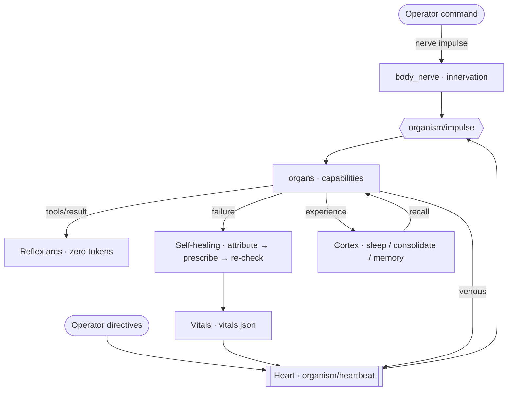

<div align="center">

# Agent‑Body

**An organ‑based plugin layer for [DeepSeek Harness](https://github.com/deepseek-ai/deepseek-harness): organs, nerve impulses, a heartbeat, reflex arcs, long‑term memory, and closed‑loop self‑healing.**

*Plugins here are not a tool list. They are organs in a living system.*

[](#organ-catalog)
[](#token-economy)
[](#verify-it-yourself)
[](#quick-start)
[](LICENSE)

[Architecture](ARCHITECTURE.md) · [Organ Catalog](#organ-catalog) · [Verify](#verify-it-yourself) · [**中文文档**](README.zh-CN.md)

</div>

---

## Why this exists

Every agent framework eventually becomes the same thing: a pile of tools, a growing list in the system prompt, and an
agent that forgets everything between sessions.

It re-reads the same failure twice before learning it exists. It cannot tell you which of its own capabilities are
broken. It has no idea that a plugin it depends on went offline — it just calls it and fails. And you keep paying tokens
for tool schemas nobody calls.

**Agent‑Body takes the opposite bet: treat the plugin system as an organism.**

Every plugin declares itself an *organ* — with capabilities, senses, and reflexes. Everything else is physiology: a
nervous system that routes your commands to the right organ, a heart that pumps state through the whole body on a
rhythm, reflex arcs that fire without a single model call, and a healing loop that attributes every failure before it
even thinks about retrying.

The result is a system that gets **measurably better the more you use it**, and that stays standing when you rip parts
of it out.

---

## What makes it different

### 🫀 It has a heartbeat, not a loop

A real pacemaker runs at a 1s base clock with a **variable interval** — 3× faster on critical alerts, 2× on fatigue,
2× slower when the body has been silent for a long while. Every beat packages the current operator directives, the
body's proprioception and the homeostasis warnings into a blood packet, writes it to `bloodstream.json`, and broadcasts
it as `organism/heartbeat`. Any organ can hook the circulation with one line:

```ts
ctx.on('organism/heartbeat', (blood) => { /* your organ now has a pulse */ })
```

Circulation is a loop, not a firehose: organs return blood through `organism/venous`, and newly learned knowledge is
oxygenated (`organism/oxygenated`) before it is pumped system‑wide.

### 🧠 Your sentence becomes a nerve impulse

You type a command. Before the model even reasons about it, `agent/pre-step` converts it into an impulse, deterministically
*innervates* the organs that should handle it, and broadcasts on `organism/impulse` — telling each organ **which of its
capabilities to use**.

Then the body learns the route. When an innervated organ actually delivers, a Hebbian synapse strengthens
"this kind of command → that organ"; when it fails, the weight decays. Dispatch order reorders itself from experience,
persisted in `synapses.json`.

```
you:  "抓取这个站点并抽取结构化数据"
impulse → sensory(web-crawl) · executive(plan) · immune(verify)
        → each organ told which capability to fire
```

### 🩹 Self‑healing is a closed loop, not a slogan

```
failure → deterministic attribution → prescription → RE‑CHECK
```

Attribution is not guessing: `tool_missing` / `arg_error` / `permission` / `timeout` / `network` / `not_found` /
`conflict` / `unknown`. The prescription table decides the response — read‑only remedies execute automatically,
side‑effecting ones wait for the brain to rule, and **`arg_error` is never auto‑retried** (retrying a wrong argument
just amplifies the mistake).

The wound only closes when **that organ next succeeds** — the system does not declare itself healed. Anything still open
after 5 minutes is marked `chronic` and stops spinning.

> Measured on the development install: **21 wounds healed · 100% heal rate · 0 chronic.** An `arg_error` wound closed
> 3.5s after the underlying fix landed.

### 🌱 It trains itself — and forgets on purpose

Three learning channels run continuously, none of them requiring you to teach anything:

1. **Synaptic learning** — success reinforces "command class → organ", failure weakens it.
2. **Reflex self‑authoring** — the same tool × cause failing 3 times makes the system **write its own reflex arc**
   (`R-auto-<cause>-<tool>`), which then fires automatically on the next occurrence.
3. **Chain crystallization** — any cross‑organ chain that completes with ≥3 steps is fixed into a replayable skill.

Forgetting is equally deliberate: synapses decay on a 30‑minute half‑life and get pruned below `|w| < 0.2`; reflexes
that fired ≥5 times with zero contribution are retired; skills that keep failing are forgotten.

`body_heal action=rehab` restores an organ to its healthy baseline — **damage cleared, wisdom kept**: fatigue and wounds
reset, learned synapses, reflexes and skills untouched.

### 💤 It sleeps, consolidates, and remembers

Idle for 2 minutes → light sleep. 5 minutes → deep sleep, and every 2 minutes of deep sleep runs a **consolidation
pass with zero model calls** — pure deterministic rules mining the experiences of the day into long‑term memory:

| Card | Mined from |
| --- | --- |
| `pitfall` | same tool failing ≥3 times in a row |
| `playbook` | a cross‑tool success chain repeating ≥2 times (trivial same‑tool repeats filtered out) |
| `hotspot` | ≥8 calls with <70% success rate |
| `unresolved` | ≥3 failures accumulated after the last success |
| `fact` | explicit operator facts |

New commands trigger deterministic recall — tags > title > body, multiplied by weight — and the most relevant cards are
injected into context. Unused cards decay on a 168‑hour half‑life and **archive instead of being deleted**.

### 🪶 Zero‑residence context

Instead of lossy LLM summarization, the engine replaces resident content with **deterministic pointers** — and every
masked byte stays recoverable verbatim from the session log:

| Tool | Purpose |
| --- | --- |
| `zr_compact` | arm a forced compaction that bypasses the ratio threshold |
| `zr_recall` | rebuild masked content verbatim, by tool call id or session seq |
| `zr_ledger` | quantify the attention integral, the three‑segment cost split, and the compression ratio |
| `zr_fast` | run long commands asynchronously and never block the turn |

### 🧩 Organs are optional — the architecture is not

Six kernels depend on no single organ: **nerve bus · heart pump · directive layer · reflex engine · dissector ·
impulse conduction**.

Unplug a plugin and the body keeps running. Uninstalling `dsh-office-docs` was detected immediately — the `craft` organ
went offline and its capability was **compensated by the closest overlapping organ**, core integrity still green. An
organ that is not installed at all is reported as *not installed*, not as *broken* — which eliminated a 15‑second
warning storm from a phantom organ.

<a id="token-economy"></a>

### 📉 Token economy as a first‑class concern

Tool schemas are shown on demand, gated by what the current turn is actually about:

> **49 of 256 capabilities exposed per request** — `10,173` tokens instead of `55,154`. **~82% saved**, with everything
> else still one `body_call` away.

---

## The five biological layers

| Layer | What it is | Count |
| --- | --- | --- |
| **Individual** | this body (the running install) | 1 |
| **System** | eight body systems: executive / nervous / immune / sensory / motor / memory / metabolic / endocrine | 8 |
| **Organ** | a plugin, obeying one contract: sense → reflex → effect → homeostasis | **23** in this repository |
| **Tissue** | functional clustering inside an organ: sensing / inspection / effect / synthesis / memory / regulation / clearance / metering / matrix | 9 classes |
| **Cell** | a single capability unit (one tool) | counted at runtime |

Every layer is observable: `body_map` (organs + systems), `body_cell` (cells + tissues), `body_status` (vitals).
Undeclared plugins are auto‑promoted to *autonomic organs* — on the development install, **256/256 capabilities were
claimed, zero orphans**.

---

## Architecture at a glance



Full detail — three kernels, five life mechanisms, event contracts, on‑disk state, verification methodology — lives in
**[ARCHITECTURE.md](ARCHITECTURE.md)**.

---

## Organ catalog

Every entry below is a real plugin under `workspace/plugins/`. Five core organs ship a full **offline regression suite**
(see [Verify it yourself](#verify-it-yourself)); the remaining organs are exercised through their replay scripts.

| Organ | Plugin | System | Signature capabilities |
| --- | --- | --- | --- |
| **Organism kernel** | `dsh-organism` | nervous · endocrine | `body_map` `body_cell` `body_status` `body_heart` `body_law` `body_nerve` `body_call` `body_reflex` `body_heal` `body_skill` `body_organ` `body_pulse` `body_tokens` |
| **Cortex** | `dsh-cortex` | memory | `cortex_sleep` `cortex_memory` `cortex_homeo` |
| **Zero‑residence** | `dsh-zero-residence` | metabolic | `zr_compact` `zr_recall` `zr_ledger` `zr_fast` |
| **Web crawl** | `dsh-web-crawl` | sensory | `webcrawl` `webcrawl_site` `webcrawl_map` `webcrawl_extract` `webcrawl_doc` `webcrawl_http` `webcrawl_links` `webcrawl_status` |
| **Browser ultimate** | `dsh-browser-ultimate` | sensory | real browser engine (logged‑in sessions, anti‑bot resilience, CDP) + readability‑style extraction |
| **War bridge** | `dsh-war-bridge` | nervous | `ida` (IDA Pro MCP bridge) `war_status` `war_case` `war_memory` |
| **PentAGI** | `dsh-pentagi` | executive | `agi_plan` `agi_next` `agi_flow` `agi_memory` `agi_reflect` `agi_report` `agi_team` |
| **Sec workbench** | `dsh-sec-workbench` | immune | 49 `sec_*` capabilities: `sec_route` `sec_scope` `sec_evidence` `sec_webscan` `sec_webtest` `sec_exec` `sec_jwt` `sec_hashoff` `sec_brute` `sec_lateral` `sec_stealth` `sec_journal` `sec_report` … |
| **Reverse skill** | `dsh-reverse-skill` | immune | `rev_route` (44 routing rules) `rev_case` `rev_doctrine` `rev_playbook` `rev_journal` `rev_toolindex` |
| **Vuln remediator** | `dsh-vuln-remediator` | immune | `vuln_scan` `vuln_cve` `vuln_sbom` `vuln_priority` `vuln_patch_gen` `vuln_patch_verify` `vuln_remediate` `vuln_plan` `vuln_knowledge` |
| **Vuln daily loop** | `dsh-vuln-mastery-loop` | immune | scheduled daily practice loop with reporting |
| **Quant OS** | `dsh-quant` | executive | 59 `quant_*` capabilities: data / alpha / ML / risk / execution, `quant_research_pipeline` `quant_backtest` `quant_walk_forward` `quant_portfolio_optimize` `quant_stress_test` … |
| **Mastery loop** | `dsh-mastery-loop` | endocrine | `study_orient` `study_deconstruct` `study_model` `study_diagnose` `study_transfer` `study_review` `study_path` |
| **Academic research** | `dsh-academic-research` | executive | `ars_pipeline` (10‑stage state machine) `ars_review` (5‑seat panel) `ars_paper_plan` `ars_integrity` `ars_metrics` |
| **Office docs** | `dsh-office-docs` | motor | PDF / DOCX / PPTX / XLSX build, extract, render‑verify, pandoc convert |
| **Social card** | `dsh-social-card` | motor | `social_card_scaffold` `social_card_render` `social_card_validate` `social_card_docs` |
| **Agent teams** | `dsh-agent-teams-pro` | executive | captain + members, task dependencies, messaging, live web panel |
| **MiroFish** | `dsh-mirofish` | executive | `mirofish_status` `mirofish_api` — swarm‑intelligence prediction engine client |
| **Minimal gray** | `dsh-minimal-gray` | metabolic | minimal agent preset, platform‑adaptive shell |
| **DingTalk bridge** | `dsh-dingtalk-bridge` | nervous | Stream long‑connection bot bridge into the harness |
| **Fund scan** | `dsh-daily-fund-scan` | executive | scheduled fund pool scan + advice report |
| **File chips** | `dsh-file-chips` | sensory | attachment chips in the composer |
| *(legacy)* | `dsh-crawl4ai` | sensory | kept for rollback; superseded by `dsh-web-crawl` |

---

## Quick start

This repository is the **organ layer** — it does not vendor the host. Two pieces, both public:

```powershell
# 1) the host: DeepSeek Harness itself
git clone https://github.com/deepseek-ai/deepseek-harness.git
#    follow that repository's build/run instructions; note where the checkout lives

# 2) the organs: this repository
git clone https://github.com/1420079678-ctrl/agent-body.git
```

Point the tooling at your host checkout, then bring an organ online. Each organ ships a **replay script** that links its
dependencies, compiles it, runs its offline regression, and tells you how to inject it:

```powershell
$env:DSH_CHECKOUT = "C:\path\to\deepseek-harness"

pwsh -File agent-body\workspace\plugins\dsh-organism\scripts\replay-organism.ps1
```

Replay scripts are idempotent — re-run them after a host upgrade to restore the organ. The same shape works for every
organ in the catalog (`replay-cortex.ps1`, `replay-web-crawl.ps1`, …).

Once injected, the first three commands to try:

```
body_status                 # full vitals: organs, fatigue, homeostasis, integrity self-check
body_map                    # the anatomy — which organ owns which capability
body_nerve action=send text="<your command>"   # route a command before executing it
```

---

## Verify it yourself

Every organ carries an **offline, deterministic** regression suite — no network, no model, safe to re-run anytime.

```powershell
npm run verify          # repository health check (structure, JSON, links, secret hygiene)
npm run verify:organs   # run every organ's offline regression
```

| Organ | Command | Result (measured) |
| --- | --- | --- |
| `dsh-organism` | `node scripts/smoke-test.mjs` | **79 passed / 0 failed** (familyOf, evalCondition, decay, pruning, token estimation, gating contract) |
| `dsh-cortex` | `node scripts/smoke-test.mjs` | **58 passed / 0 failed** (tokenization, card mining, noise reduction) |
| `dsh-war-bridge` | `node scripts/smoke-test.mjs` | 24 assertions, incl. full IDA chain + idempotent handoff |
| `dsh-web-crawl` | `python scripts/selftest_local.py` | 46 offline assertions (extraction, magic‑byte routing, cascade) |
| `dsh-zero-residence` | `node scripts/smoke-test.mjs` | pointer compression + recall integrity |

Runtime state is observable too — vitals, wounds, synapses and the pulse stream are all first‑class data:

```
body_status      → organs · capabilities claimed · heartbeat #31 @15s · heal rate 100%
body_heal        → 21 wounds healed · 0 chronic
body_pulse       → last nerve impulses, reflex fires, homeostasis alerts
```

---

## Repository layout

```
agent-body/
├─ workspace/
│  └─ plugins/      the organs — one plugin per organ, each with src/ + lib/ + an offline regression
├─ scripts/         verify-repo.mjs · run-organ-regressions.mjs
├─ .github/         CI (repo-check on Windows + Linux) and issue templates
├─ ARCHITECTURE.md  full system architecture
└─ README.zh-CN.md  中文文档
```

Runtime state (vitals, synapses, memory cards, pulse stream) lives in your harness data home, never in this repository.

---

## Roadmap

- [ ] Publish the organ contract as a standalone SDK so third‑party plugins can declare organs in a few lines
- [ ] One‑command organ installer that links, builds and registers every organ against a given host checkout
- [ ] Cross‑body sync: export learned synapses / reflexes / skills and import them into another install
- [ ] Sleep‑time model training: let consolidation propose new reflexes for review instead of authoring them directly
- [ ] Web panel for the anatomy: live organ map, wound ledger, pulse stream

---

## Notes

- **Licensing.** MIT for this project's own work ([LICENSE](LICENSE)). Plugins ported from upstream projects and the
  host itself keep their own terms — see [THIRD_PARTY_NOTICES.md](THIRD_PARTY_NOTICES.md).
- **Local‑first.** The harness GUI binds `127.0.0.1` — it can read files and execute commands on the machine it runs on.
  Do not expose it to a network or put it behind a public reverse proxy.
- **Windows‑first.** Developed and measured on Windows 11 · Node 24 · PowerShell 7. Several organs ship
  Windows‑specific hardening (hidden‑window spawning, ACL sandbox compatibility). Linux/macOS paths exist but are less
  exercised.
- **Numbers here are measured**, not aspirational. Figures marked *measured* were read from a live install; runtime
  counts (organs, capabilities) are yours to reproduce with `body_status`.

<div align="center">

---

**Six kernels. Twenty‑three organs. One heartbeat.**

If that's the kind of plugin platform you want, the architecture is all in [ARCHITECTURE.md](ARCHITECTURE.md).

</div>
