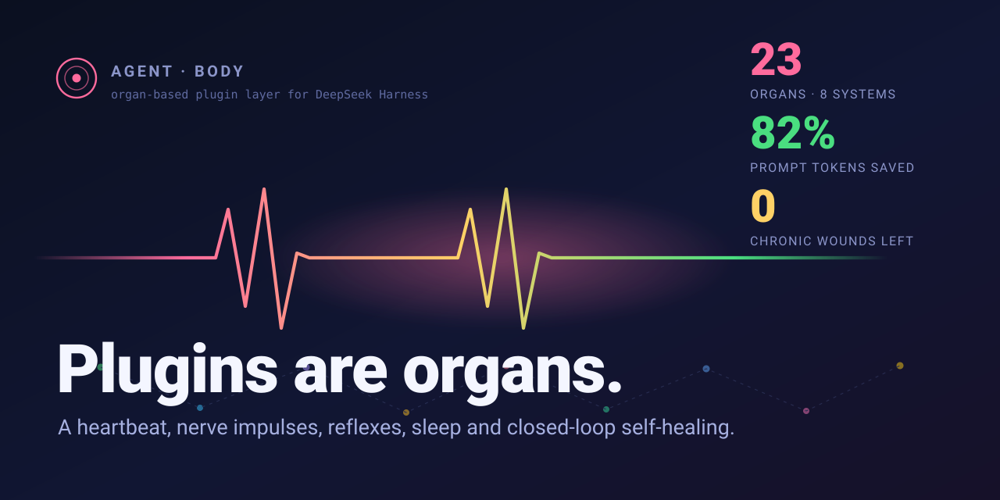
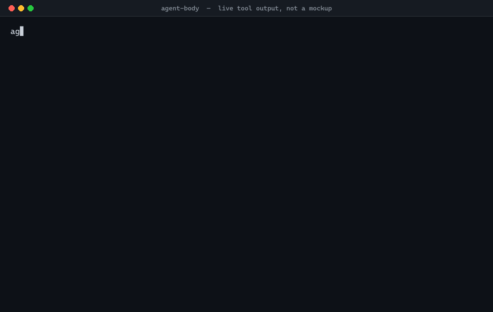
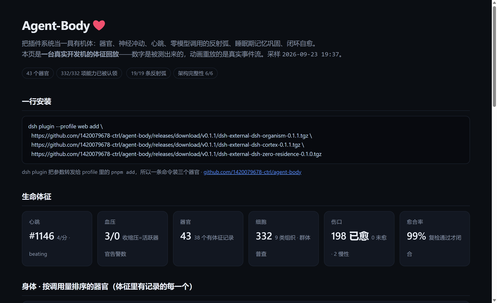
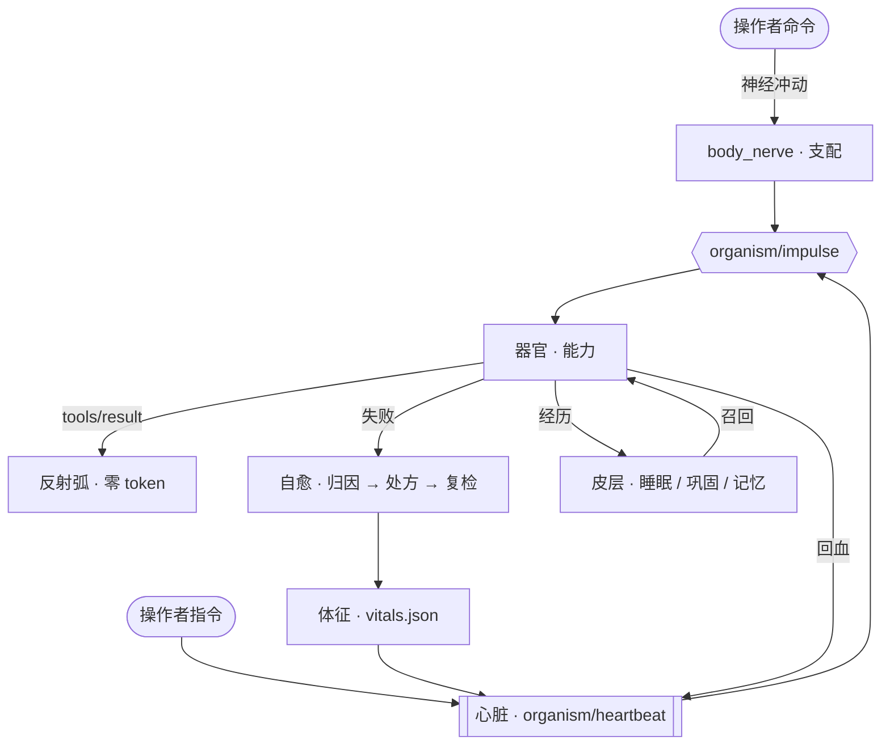

<div align="center">



# Agent‑Body

**DeepSeek Harness 的器官化插件层：器官、神经冲动、心跳、反射弧、长期记忆，以及闭环自愈。**

*这里的插件不是一份工具清单，而是一具活着的身体里的器官。*

[](#器官目录)
[](#器官目录)
[](#token-经济)
[](benchmarks/results/REPORT.md)
[](#自己验证)
[](#快速开始)
[](LICENSE)
[](https://github.com/1420079678-ctrl/agent-body/stargazers)
[](https://github.com/1420079678-ctrl/agent-body/issues)
[](https://dshfind.com/en/plugins/1420079678-ctrl/agent-body)

[架构文档](ARCHITECTURE.md) · [器官目录](catalog/organs.json) · [基准报告](benchmarks/results/REPORT.md) · [路线图](ROADMAP.md) · [**English**](README.md)

[官方 DSH 讨论区 · **Show Your Plugins!**](https://github.com/deepseek-ai/deepseek-harness/discussions/7555) · 官方 `CONTRIBUTING` 指定给插件作者的展示通道

**v0.1.1** · MIT · Windows 优先（Node 22.19 / 24） · **目录内 26 个器官，由本仓库 23 个插件包实现** · [发布说明](https://github.com/1420079678-ctrl/agent-body/releases/tag/v0.1.1)

<a href="docs/demo/captured.json"></a>

上面这具身体正在运行——**不是示意图**。每一帧都是真机的工具输出，由 `tools/make-demo-gif.py` 从
[`docs/demo/captured.json`](docs/demo/captured.json) 渲染而来，该文件记录的是原始输出。
渲染器**拒绝画出任何不在这份文件里的数字**。

从左到右读：解剖与体征 → token 账本 → **一句中文命令变成神经冲动**、支配 4 个器官并逐一告知该开哪项能力（决定路由花掉的模型调用：0）→ 一个被归因为 `arg_error` 的伤口，处方是**不重试**，最终经复检闭合。

[](https://1420079678-ctrl.github.io/agent-body/)

▶ **[打开在线 demo](https://1420079678-ctrl.github.io/agent-body/)** —— 一台真实安装的体征回放：心跳、器官、脉冲流、自愈账本与 token 门控，不用装任何东西。页面由运行时文件（`vitals.json`、`bloodstream.json`、`pulse.jsonl`）生成，不是照抄截图。

**目录** · [为什么做这个](#为什么做这个) · [它有什么不一样](#它有什么不一样) · [五层生物层级](#五层生物层级) · [架构一览](#架构一览) · [器官目录](#器官目录) · [快速开始](#快速开始) · [写自己的器官](#写自己的器官) · [自己验证](#自己验证) · [什么时候不要用这个](#什么时候不要用这个) · [常见问题](#常见问题) · [仓库结构](#仓库结构) · [参与贡献](#参与贡献) · [路线图](#路线图)

</div>

---

## 一行安装

```powershell
dsh plugin --profile web add `
  https://github.com/1420079678-ctrl/agent-body/releases/download/v0.1.1/dsh-external-dsh-organism-0.1.1.tgz `
  https://github.com/1420079678-ctrl/agent-body/releases/download/v0.1.1/dsh-external-dsh-cortex-0.1.1.tgz `
  https://github.com/1420079678-ctrl/agent-body/releases/download/v0.1.1/dsh-external-dsh-zero-residence-0.1.0.tgz
```

```bash
dsh plugin --profile web add \
  https://github.com/1420079678-ctrl/agent-body/releases/download/v0.1.1/dsh-external-dsh-organism-0.1.1.tgz \
  https://github.com/1420079678-ctrl/agent-body/releases/download/v0.1.1/dsh-external-dsh-cortex-0.1.1.tgz \
  https://github.com/1420079678-ctrl/agent-body/releases/download/v0.1.1/dsh-external-dsh-zero-residence-0.1.0.tgz
```

`dsh plugin` 会把参数原样转发给 profile 目录里的 `pnpm add`，所以一条命令能装多个包。装完重启 harness，`body_status`
就应该列出这些器官。目录里其余器官各是一个 tarball，见[快速开始](#快速开始)。

## 先看证据

| 你想要… | 打开… | 能核到什么 |
| --- | --- | --- |
| 不装任何东西先看它跑 | `npm run demo` | 一条真实的「命令 → 冲动 → 支配 → 执行 → 归因 → 反射」链路，离线、无需 key |
| 让提示词少塞点工具表 | [`benchmarks/results/REPORT.md`](benchmarks/results/REPORT.md) · `npm run bench:check` | 48 条命令上门控掉 **84.71%** 的 tool schema token（冷启动，可复现）；带历史口径 58%（2026-09-25 实装，332 项） |
| 让同一个失败别再犯第二遍 | `body_heal` | 重试之前先归因：`tool_missing` / `arg_error` / `permission` / `timeout` / `network` / `not_found` / `conflict`。开发机实测：**愈合 198、未愈 0、愈合率 99%** |
| 确认系统还活着 | `body_status` · `body_heart` | 43 个器官、**332/332** 项能力已被认领、第 1121 跳、架构完整性 6/6（*开发机实测*） |
| 拆掉一个器官身体还在 | `body_organ action=integrity` | 核心六件套不依赖任何单个器官；`body_call` 由能力重叠最高的器官代偿 |
| 写自己的器官 | [`docs/ORGAN_SDK.md`](docs/ORGAN_SDK.md) | `defineOrgan()` 在声明处校验并带字段路径抛错；`npm run check` 把整个仓库纳入闸门 |

---

## 为什么做这个

几乎所有 Agent 框架最后都会长成同一个样子：一堆工具、一份越来越长的系统提示词清单，以及一个**会话之间什么都记不住**的 agent。

同一个错误它要犯第二遍才「知道」它存在。它说不清自己哪项能力是坏的。它根本不知道某个依赖的插件已经掉线了——它只是照常调用、然后失败。而你还在一轮轮地为那些从没人调用的工具 schema 付 token。

**Agent‑Body 押的是相反的一注：把插件系统当成一具有机体来对待。**

每个插件都声明自己是一个**器官**——带着能力、感知和反射。其余的一切都是生理活动：一套把你的命令路由到正确器官的神经系统，一颗按节律把状态泵向全身的心脏，一些**完全不消耗模型调用**就能开火的反射弧，以及一条在考虑重试之前先把失败归因清楚的愈合回路。

结果就是：这套系统**用得越多越好**，而且你把某些部分拆掉，它依然站得住。

---

## 它有什么不一样

### 🫀 它有一颗心脏，不是一个循环

真正的起搏器以 1 秒为基准时钟，并**可变间期**——危重告警时快 3 倍、疲劳时快 2 倍、长时间静默时慢 2 倍。每一跳把当前的操作者指令、本体感觉与稳态告警打包成一份血液包，写入 `bloodstream.json`，并以 `organism/heartbeat` 广播出去。任何器官一行代码就能接上这套循环：

```ts
ctx.on('organism/heartbeat', (blood) => { /* 你的器官从此有了脉搏 */ })
```

循环是闭环而不是单向喷灌：器官经 `organism/venous` 回血，新学到的知识先经 `organism/oxygenated` 氧合，再泵向全身。

### 🧠 你的一句话会变成一束神经冲动

你输入一条命令。在模型还没开始推理之前，`agent/pre-step` 就把它转换成冲动，确定性地**支配（innervate）**应该处理它的器官，并广播 `organism/impulse`——告诉每个器官**该用自己哪一个能力**。

然后身体会记住这条路线。被支配的器官真的把活干成了，一条 Hebbian 突触就强化「这类命令 → 那个器官」；干砸了就衰减。支配顺序会自己重排，并持久化在 `synapses.json`。

```
你：  "抓取这个站点并抽取结构化数据"
冲动 → 感官(web-crawl) · 执行(plan) · 免疫(verify)
     → 每个器官都被点名该开哪一项能力
```

### 🩹 自愈是闭环，不是口号

```
失败 → 确定性归因 → 按处方处置 → 复检
```

归因靠的是判定而不是猜：`tool_missing` / `arg_error` / `permission` / `timeout` / `network` / `not_found` / `conflict` / `unknown`。处方表决定怎么处置——只读类自动执行，有副作用的留给大脑裁决，而且 **`arg_error` 绝不自动重试**（参数错了还重试，只会把错误放大）。

伤口只有在**那个器官下次成功**时才会闭合——系统不会自己宣布自己痊愈了。超过 5 分钟仍未闭合的伤口标记为 `chronic`，停止空转。

> 在开发机上实测：**21 个伤口愈合 · 愈合率 100% · 0 个慢性伤口。** 一个 `arg_error` 伤口在真正的修复落地后 3.5 秒闭合。

### 🌱 它会自己训练，也会主动遗忘

三条学习通道持续运行，你不需要专门教它任何东西：

1. **突触学习**——干成就强化「命令类别 → 器官」，干砸就削弱。
2. **反射自生成**——同一个「工具 × 病因」失败 3 次，系统会**自己写出一条反射弧**（`R-auto-<病因>-<工具>`），下次同样失败时自动开火。
3. **链路固化**——任何跨器官链路跑通且 ≥3 步，就被固化成可重放的技能。

遗忘同样是刻意的：突触按 30 分钟半衰期衰减，权重低于 `|w| < 0.2` 且已有样本就修剪；开火 ≥5 次却零贡献的反射退役；连续失败的技能被遗忘。

`body_heal action=rehab` 把器官恢复到健康基线——**损伤清除，智慧保留**：疲劳与伤口归零，已学到的突触、反射、技能一条不动。

### 💤 它会睡觉、巩固、记住

静默 2 分钟进入浅睡，5 分钟进入深睡；深睡中每 2 分钟跑一轮**零模型调用的巩固**——纯确定性规则，把这一天的经历提炼成长期记忆：

| 记忆卡 | 提炼自 |
| --- | --- |
| `pitfall`（坑） | 同一工具连续失败 ≥3 次 |
| `playbook`（打法） | 跨工具成功链路重复 ≥2 次（同工具重复的平凡链路被过滤） |
| `hotspot`（薄弱环节） | 调用 ≥8 次且成功率 <70% |
| `unresolved`（未解） | 最后一次成功之后累计 ≥3 次失败 |
| `fact`（事实） | 操作者明确给出的事实 |

新命令进来会触发确定性召回——标签 > 标题 > 正文，再乘权重——最相关的几张卡被注入上下文。久未使用的卡按 168 小时半衰期衰减，并且是**归档而不是删除**。

### 🪶 零驻留上下文

这套引擎不用有损的 LLM 摘要，而是把常驻内容替换成**确定性指针**——并且每一个被遮蔽的字节都能从会话日志里逐字还原：

| 工具 | 作用 |
| --- | --- |
| `zr_compact` | 武装一次强制压缩，绕过比例阈值 |
| `zr_recall` | 按工具调用 id 或会话序号逐字重建被遮蔽的内容 |
| `zr_ledger` | 量化注意力积分、三段成本分解与压缩比 |
| `zr_fast` | 长命令异步执行，绝不阻塞当前回合 |

### 🧩 器官可以缺，架构不会动

六个内核不依赖任何一个器官：**神经总线 · 心脏泵 · 指令层 · 反射引擎 · 解剖器 · 冲动传导**。

拔掉一个插件，身体照常运转。卸载 `dsh-office-docs` 时立刻被检出——`craft` 器官离线，它的能力**由重叠度最高的器官代偿**，核心完整性依旧全绿。根本没安装的器官会被如实报告为「未安装」而不是「坏掉」——这一条根治了一场每 15 秒刷一次告警的风暴。

<a id="token-经济"></a>

### 📉 把 token 经济当成一等公民

工具 schema 按需显影，由「这一轮到底在干什么」决定。

**下面每个数字的口径：只算提示词里的 tool schema 块**——每个工具定义的 `name` + `description` + JSON schema。
不含系统提示正文、不含对话历史、不含工具结果。

> **84.7% 的 tool schema token 被门控掉（冷启动口径）**——48 条代表性命令上，`55,154` → 均值 `8,433`
> （中位 85.7%，最差 75.2%），分母是 **256 项能力定义**。其余能力离一次 `body_call` 之遥。

这个数字由仓库内的基准产出，**在你机器上可复现**：

```bash
npm run bench          # 重新生成 benchmarks/results/REPORT.md
npm run bench:check    # 与提交的基线不一致就非零退出
```

两点如实说明，因为这个标题数字很容易被过度解读：

- **冷启动口径**。上面的数字假设身体没有近期活动——只由当前命令决定显影哪些能力。带真实运行历史时，
  近期用过的器官与高信任器官会保持「热」，显影集变大、省下的变少。以下是实测的活体数字，由新到旧：

  | 实测日期 | 口径 | 显影 | 省下 |
  | --- | --- | --- | --- |
  | 2026‑09‑25 | 本机实装（332 项能力，带真实运行历史） | 127 / 332 | **58%** |
  | 2026‑09‑11 | 固化在 `benchmarks/corpus/trace-live-gate.json` 的快照 | 64 / 256 | 74% |
  | 更早 | 历史版本 README 引用过的某次活体快照 | — | 82% |

  两个极端都真实，**引用时必须带上口径**。冷启动那个数是可复现的那个——你可以自己跑。活体那个数才是
  身体跑久之后你实际会看到的，而它会随身体长大而下降：历史越多，保持「热」的器官越多。**这个「变差」的
  数字我们是故意登出来的**——因为你只要自己跑一次 `body_tokens` 就会看见它。
- **48 条命令里有 10 条需要第二次跳转**。单器官显影上限 10 项，意味着大型器官（攻击链有 49 项）会被截断，
  另有一些意图没有路由到拥有该能力的器官。这些都能经 `body_call` 取回，但**不是免费的**。
  基准把每一条漏显影归因为 *缺陷 / 被截断 / 未路由* 三类并逐条列在
  [`benchmarks/results/REPORT.md`](benchmarks/results/REPORT.md)。

---

## 五层生物层级

| 层级 | 是什么 | 数量 |
| --- | --- | --- |
| **个体** | 这具身体（正在运行的那套安装） | 1 |
| **系统** | 人体八大系统：执行 / 神经 / 免疫 / 感官 / 运动 / 记忆 / 代谢 / 内分泌 | 8 |
| **器官** | 一个插件，遵守同一份契约：感知 → 反射 → 效应 → 稳态 | 策展 **26** 个（见 [`catalog/organs.json`](catalog/organs.json)），其中 **23** 个是可安装的插件包 |
| **组织** | 器官内部的功能细分：感知 / 检验 / 效应 / 合成 / 记忆 / 调控 / 清除 / 计量 / 基质 | 9 类 |
| **细胞** | 单个能力单元（一个工具） | 运行时统计 |

每一层都可观测：`body_map`（器官与系统）、`body_cell`（细胞与组织）、`body_status`（生命体征）。未申报的插件会被自动升格为**自主神经器官**——开发机上实测 **256/256 项能力全部被认领，0 游离**。

---

## 架构一览



完整细节——三大内核、五项生命机制、事件契约、落盘状态、验证方法——见 **[ARCHITECTURE.md](ARCHITECTURE.md)**。

---

## 器官目录

下表每一项都是 `workspace/plugins/` 下真实存在的插件。其中五个核心器官带完整的**离线回归测试**（见[自己验证](#自己验证)）；其余器官通过各自的重放脚本验证。

| 器官 | 插件 | 系统 | 标志性能力 |
| --- | --- | --- | --- |
| **器官内核** | `dsh-organism` | 神经 · 内分泌 | `body_map` `body_cell` `body_status` `body_heart` `body_law` `body_nerve` `body_call` `body_reflex` `body_heal` `body_skill` `body_organ` `body_pulse` `body_tokens` |
| **皮层** | `dsh-cortex` | 记忆 | `cortex_sleep` `cortex_memory` `cortex_homeo` |
| **零驻留** | `dsh-zero-residence` | 代谢 | `zr_compact` `zr_recall` `zr_ledger` `zr_fast` |
| **网页抓取** | `dsh-web-crawl` | 感官 | `webcrawl` `webcrawl_site` `webcrawl_map` `webcrawl_extract` `webcrawl_doc` `webcrawl_http` `webcrawl_links` `webcrawl_status` |
| **浏览器** | `dsh-browser-ultimate` | 感官 | 真实浏览器引擎（登录态、抗反爬、CDP）+ 正文抽取 |
| **战友桥** | `dsh-war-bridge` | 神经 | `ida`（IDA Pro MCP 直连桥）`war_status` `war_case` `war_memory` |
| **PentAGI** | `dsh-pentagi` | 执行 | `agi_plan` `agi_next` `agi_flow` `agi_memory` `agi_reflect` `agi_report` `agi_team` |
| **安全工作台** | `dsh-sec-workbench` | 免疫 | 49 项 `sec_*` 能力：`sec_route` `sec_scope` `sec_evidence` `sec_webscan` `sec_webtest` `sec_exec` `sec_jwt` `sec_hashoff` `sec_brute` `sec_lateral` `sec_stealth` `sec_journal` `sec_report` … |
| **逆向技能** | `dsh-reverse-skill` | 免疫 | `rev_route`（44 条路由规则）`rev_case` `rev_doctrine` `rev_playbook` `rev_journal` `rev_toolindex` |
| **漏洞修复** | `dsh-vuln-remediator` | 免疫 | `vuln_scan` `vuln_cve` `vuln_sbom` `vuln_priority` `vuln_patch_gen` `vuln_patch_verify` `vuln_remediate` `vuln_plan` `vuln_knowledge` |
| **漏洞日练** | `dsh-vuln-mastery-loop` | 免疫 | 定时日练闭环 + 报告 |
| **量化 OS** | `dsh-quant` | 执行 | 59 项 `quant_*` 能力：数据 / 因子 / 机器学习 / 风控 / 执行，`quant_research_pipeline` `quant_backtest` `quant_walk_forward` `quant_portfolio_optimize` `quant_stress_test` … |
| **精通闭环** | `dsh-mastery-loop` | 内分泌 | `study_orient` `study_deconstruct` `study_model` `study_diagnose` `study_transfer` `study_review` `study_path` |
| **学术研究** | `dsh-academic-research` | 执行 | `ars_pipeline`（10 阶段状态机）`ars_review`（5 席位评审）`ars_paper_plan` `ars_integrity` `ars_metrics` |
| **Office 文档** | `dsh-office-docs` | 运动 | PDF / DOCX / PPTX / XLSX 构建、提取、渲染校验、pandoc 互转 |
| **解剖面板** | `dsh-anatomy-panel` | nervous | `/anatomy` 上的活体体征：心跳、伤口、学习计数、器官调用量与真实脉冲流——每次请求现读器官的运行时文件 |
| **社交卡** | `dsh-social-card` | 运动 | `social_card_scaffold` `social_card_render` `social_card_validate` `social_card_docs` |
| **Agent 小队** | `dsh-agent-teams-pro` | 执行 | 队长 + 成员、任务依赖、消息传递、实时 Web 面板 |
| **MiroFish** | `dsh-mirofish` | 执行 | `mirofish_status` `mirofish_api`——群体智能预测引擎客户端 |
| **极简灰度** | `dsh-minimal-gray` | 代谢 | 极简 agent 预设、平台自适应 Shell |
| **钉钉桥** | `dsh-dingtalk-bridge` | 神经 | Stream 长连接机器人桥接进 harness |
| **基金扫描** | `dsh-daily-fund-scan` | 执行 | 定时基金池扫描 + 建议报告 |
| **文件芯片** | `dsh-file-chips` | 感官 | 输入框里的附件芯片 |
| *（遗留）* | `dsh-crawl4ai` | 感官 | 保留用于回滚，已被 `dsh-web-crawl` 取代 |

---

## 快速开始

### 先看它跑起来——不装依赖、不需要宿主、不需要 API key

```bash
git clone https://github.com/1420079678-ctrl/agent-body && cd agent-body
npm run demo      # 命令 → 冲动 → 支配 → 执行 → 失败归因 → 反射开火
npm run check     # 常量表 + 器官目录 + 消息来源 + 30 项测试 + 基准比对，全部离线
```

**没有任何东西需要安装。** 核心包不 import Node 内置模块以外的任何东西，所以刚 clone 下来就能对着
仓库里真实的 256 项能力语料跑通一条完整链路。

然后看 [`benchmarks/results/REPORT.md`](benchmarks/results/REPORT.md) 了解那个 token 数字是怎么测出来的，
看 [`ROADMAP.md`](ROADMAP.md) 了解接下来**故意不做**什么。

### 一条命令装一个器官

自带依赖的器官在 Release 页面上附了**预构建 tarball**——不用 clone、不用编译。包内声明了 `dsh.bundle`，所以安装时会自动把它加进 `dsh.profile.bundles`，下次启动即挂载：

```powershell
dsh plugin --profile web add https://github.com/1420079678-ctrl/agent-body/releases/download/v0.1.1/dsh-external-dsh-organism-0.1.1.tgz
```

已按这种方式发布的共有十个器官——都是不需要外部工具链的。把 tarball 文件名接到 Release 地址后面即可：

| 器官 | tarball | 带来什么 |
| --- | --- | --- |
| `dsh-organism` | `dsh-external-dsh-organism-0.1.1.tgz` | 身体内核：解剖、体征、心跳泵、神经冲动、反射弧、自愈账本、按需显影的 schema 门控 |
| `dsh-cortex` | `dsh-external-dsh-cortex-0.1.1.tgz` | 睡眠相位、确定性巩固、长期记忆、告警降噪 |
| `dsh-zero-residence` | `dsh-external-dsh-zero-residence-0.1.0.tgz` | 零驻留上下文：驱逐载荷、只留指针、需要时逐字重建 |
| `dsh-mastery-loop` | `dsh-external-dsh-mastery-loop-0.0.1.tgz` | 学科无关的精通导师：定位 → 拆解 → 建模 → 诊断 → 迁移 → 复盘 |
| `dsh-social-card` | `dsh-external-dsh-social-card-0.0.1.tgz` | 社交卡：图文组、21:9 + 1:1 封面对、实况卡 |
| `dsh-academic-research` | `dsh-external-dsh-academic-research-0.0.1.tgz` | 学术管线：10 阶段状态机、五席位评审、完整性核查协议 |
| `dsh-pentagi` | `dsh-external-dsh-pentagi-0.0.1.tgz` | 多智能体渗透大脑：13 角色、七阶段任务流、失败换路、知识库 |
| `dsh-vuln-remediator` | `dsh-external-dsh-vuln-remediator-0.0.1.tgz` | 漏洞修复：发现、风险排序、虚拟补丁、修复方案 |
| `dsh-reverse-skill` | `dsh-external-dsh-reverse-skill-0.1.0.tgz` | 逆向工作流：确定性路由、置信带、证据链、validated 门槛 |
| `dsh-office-docs` | `dsh-external-dsh-office-docs-0.0.1.tgz` | Office 文档：构建与提取 PDF/DOCX/PPTX/XLSX、渲染页面、格式互转 |

装身体内核加记忆器官：

```powershell
$rel = "https://github.com/1420079678-ctrl/agent-body/releases/download/v0.1.1"
dsh plugin --profile web add "$rel/dsh-external-dsh-organism-0.1.1.tgz"
dsh plugin --profile web add "$rel/dsh-external-dsh-cortex-0.1.1.tgz"
```

目录里其余的器官需要宿主侧工具链（编译器、浏览器或外部二进制），用各自的 replay 脚本安装——见下面的器官目录。

### 或者从源码开始

本仓库是**器官层**——不打包宿主。两件事，都是公开的：

```powershell
# 1) 宿主：DeepSeek Harness 本体
git clone https://github.com/deepseek-ai/deepseek-harness.git
#    按该仓库的构建/运行说明装好，记住 checkout 的位置

# 2) 器官：本仓库
git clone https://github.com/1420079678-ctrl/agent-body.git
```

把工具链指向你的宿主 checkout，然后让一个器官上线。每个器官都自带**重放脚本**——它会链接依赖、编译、跑离线回归，并告诉你如何注入：

```powershell
$env:DSH_CHECKOUT = "C:\path\to\deepseek-harness"

pwsh -File agent-body\workspace\plugins\dsh-organism\scripts\replay-organism.ps1
```

重放脚本是幂等的——宿主升级后重跑一次即可恢复该器官。目录里每个器官都是同一套做法（`replay-cortex.ps1`、`replay-web-crawl.ps1` …）。

注入之后，先试这三条命令：

```
body_status                 # 完整体征：器官、疲劳、稳态、架构完整性自检
body_map                    # 解剖图——哪项能力归哪个器官管
body_nerve action=send text="<你的命令>"   # 先看这条命令该由谁办，再执行
```

---

## 自己验证

下面每条都是**离线、确定性**的——不联网、不调模型、不需要安装任何东西。

```bash
npm run check     # CI 跑的那道闸：常量表 + 器官目录 + 全部测试 + 基准比对
npm run demo      # 五分钟端到端
npm run bench     # 重新生成 token 基准（写出 benchmarks/results/REPORT.md）
```

`npm run check` 是最诚实的那条。以下任一情况它就失败：零依赖内核与真实内核的常量表漂移、器官目录与源码不一致、
任一测试失败、基准偏离已提交的基线。

每个器官也各自带离线回归：

```bash
npm run verify          # 仓库体检（结构、JSON、链接、密钥卫生）
npm run verify:organs   # 跑遍所有器官的离线回归
```

| 器官 | 命令 | 结果（实测） |
| --- | --- | --- |
| `dsh-organism` | `node scripts/smoke-test.mjs` | **179 通过 / 0 失败**（familyOf、evalCondition、衰减、修剪、token 估算、显影契约） |
| `dsh-cortex` | `node scripts/smoke-test.mjs` | **58 通过 / 0 失败**（分词、记忆卡提炼、降噪） |
| `dsh-zero-residence` | `node scripts/smoke-test.mjs` | **16 通过 / 0 失败**（指针清单、账本计算、精确 id 召回） |
| `dsh-war-bridge` | `node scripts/smoke-test.mjs` | **17 通过 / 0 失败 / 1 跳过**（无样本 PE 时 IDA 链路跳过） |
| `dsh-web-crawl` | `python scripts/selftest_local.py` | 46 项离线断言（抽取、魔数路由、级联） |

**这些套件需要宿主运行时**（`@deepseek-ai/dsh-*`），所以干净 clone 上 `npm run verify:organs` 会报
**SKIP 并说明原因**（`缺少宿主运行时 @deepseek-ai/dsh-tools`），而不是静默通过；在已装 harness 的环境里才会真跑出上表数字。

其中两个器官最初是**红的**，而且失败是真的：

- `dsh-zero-residence` 报 **13 通过 / 3 失败**。根因：会话查找按**子串**匹配、返回文件系统先给到的那个目录，
  于是 `computeLedger('session-a')` 可能读到 `session-a-extra` 的日志，把请求数从 2 报成 0。已改为精确优先解析。
- `dsh-war-bridge` 在没有样本 PE 时一律报 FAIL——因为「跳过」被记成了失败断言；且 `process.exit()` 与在途
  `AbortSignal.timeout` 相撞会触发 libuv 断言，把一次全绿跑成退出码 1。两处都已修，跳过现在就是跳过。

核心包本身由 `npm test` 覆盖：**30 项断言，0 失败**，其中含一套**一致性（parity）测试**——把零依赖移植版与真实内核
逐项比对：`familyOf`/`tissueOf` 覆盖全部 256 个工具名、`innervate` 覆盖 5 条命令、`evalCondition` 覆盖 27 种组合、
`attributeFailure` 覆盖 8 类错误串，全部精确一致。本机没有内核构建时，一致性测试会**大声跳过**，而不是悄悄通过。

运行时状态同样可观测——体征、伤口、突触、脉冲流都是一等公民数据：

```
body_status      → 器官数 · 能力认领 · 心跳 #31 @15s · 愈合率 100%
body_heal        → 21 个伤口愈合 · 0 个慢性
body_pulse       → 最近的神经冲动、反射开火、稳态告警
```

---

## 写自己的器官

一个器官 = 一份声明（外加可选的钩子）。SDK 会在**声明处**校验，出错直接带上字段路径抛出来，而不是等到运行时静默失效：

```js
import { defineOrgan, injectedSource } from './packages/organ-sdk/src/index.mjs'

export default defineOrgan({
  id: 'paper_reader',
  label: '论文阅读（文献）',
  tier: 'professional',
  group: 'memory',
  purpose: '把一篇论文拆成可检索的卡片',
  capabilities: ['paper_fetch', 'paper_digest'],
  permissions: ['net:http'],
  signals: ['tools/result'],
  handles: ['network', 'timeout'],
  fallback: ['hippocampus'],
})
```

两条能省下一次半夜排查的规矩：

- **注入消息必须用生产者自己的 source kind。** `injectedSource('@you/paper-reader')` 返回
  `{ kind: 'plugin:@you/paper-reader' }` —— 这是会话格式两代都接受的唯一写法。退役写法
  `{ kind: 'plugin', plugin: ... }` 会让 v4 宿主把整轮判失败，实测口径见
  [`docs/session-format-v4-compat.md`](docs/session-format-v4-compat.md)。
- **声明你处理什么。** 声明处理 `timeout` 的器官会真的收到这类失败；不声明的，则由 `fallback` 里能力重叠的邻居代偿。

改完要过的闸：

```bash
npm run check            # 常量表 + 器官目录 + 消息来源 + 测试 + 基准
npm run verify           # 结构、JSON、链接、密钥卫生
```

完整契约见 [`docs/ORGAN_SDK.md`](docs/ORGAN_SDK.md)，把器官接进真实宿主见 [`docs/host-adapter.md`](docs/host-adapter.md)。

---

## 什么时候不要用这个

先说清楚对双方都省事：

- **你不跑 DeepSeek Harness。** 这是给某一个具体宿主的插件层，不是独立 agent 框架。
- **你需要一个冻结的第三方 API。** 宿主今年已经改过一次会话格式，把所有往会话里写消息的插件打挂；本仓库跟着宿主走，它动我们就动。
- **你需要有 SLA 的商业支持。** v0.1.1 是有可复现闸门的工作版本，但目录是围绕**一台开发机**策展的 —— 安装流程没覆盖到的路径会有毛边。
- **你需要立刻拿到 Linux/macOS 对等支持。** 若干器官带 Windows 专属加固（隐藏窗口启动、ACL 沙箱兼容）。CI 在 Linux 上跑的是零依赖内核，器官覆盖较少。

---

## 常见问题

**不装宿主能不能先试试？** 能。`npm run demo` 在零安装、无 API key 的情况下跑通一条真实的「命令 → 冲动 → 支配 → 执行 → 归因 → 反射」链路。

**它会联网或调用模型吗？** 你能自己验证的部分不会：`npm run check` 不装任何依赖、不发起任何调用。只有器官请宿主推理时才有模型调用。

**删掉一个器官会怎样？** 丢的是能力，不是身体：神经总线、心脏泵、主权层、反射引擎、解剖器与冲动传导**不依赖任何一个器官**，`body_call` 会用能力重叠最高的在线器官代偿。`body_organ action=integrity` 会把这个自检打出来。

**为什么不同地方写的器官数量不一样？** 因为是两件事：**目录里 26 个器官身份**（解剖模型，跨 8 个系统），以及**本仓库 23 个插件包**去实现它们。两处出现时都做了标注。

**84.7% 这个 token 数字怎么测的？** 只算 **tool schema token**（全部工具定义的 name + description + parameters 之和，对比门控后首轮可见的那部分），在 48 条代表性命令上，采用**冷启动**口径（只由当前命令意图决定显影集，不掺本机历史）——这是收益下界，也是唯一可被别人独立复现的口径。带运行历史的活体口径会随身体长大而下降：2026‑09‑25 实测 **58%**（332 项中显影 127 项），2026‑09‑11 的快照是 74.25%。完整口径序列见 [Token 经济](#token-经济)，原始数据在 [`benchmarks/results/REPORT.md`](benchmarks/results/REPORT.md)。

---

## 参与贡献

现在最缺的就是**又一个器官** —— 契约小到能坐着读完。

1. 在干净 clone 上跑 `npm run demo` 与 `npm run check`；如果这两条不绿，那本身就是值得提的 bug。
2. 复制 `workspace/plugins/` 下最接近的器官，用 `defineOrgan` 声明你自己的，并把条目加进 `catalog/organs.json` —— 目录是生成的，`npm run check:catalog` 会在漂移时报错，而不是让两处悄悄分叉。
3. 带上**离线回归**。目前只有 **23 个器官中的 5 个**有——`npm run verify` 会把缺测试的 18 个列出来；`npm run verify:organs`
   在缺宿主运行时会报 SKIP 并给出原因，不会静默通过。把这些测试补上，是当下最有价值的贡献。
4. 提 PR：说明这个器官做什么、属于哪个系统、以及你实际跑过的命令。

问题与讨论欢迎发到官方 [**Show Your Plugins!**](https://github.com/deepseek-ai/deepseek-harness/discussions/7555) 帖，或直接开 issue。

---

## 仓库结构

```
agent-body/
├─ workspace/
│  └─ plugins/      器官——一个插件一个器官，各自带 src/ + lib/（有离线回归的带回归）
├─ scripts/         verify-repo.mjs · run-organ-regressions.mjs
├─ .github/         CI（Windows + Linux 双平台仓库体检）与 issue 模板
├─ ARCHITECTURE.md  完整系统架构
└─ README.md        English
```

运行时状态（体征、突触、记忆卡、脉冲流）都落在你的 harness 数据目录里，永远不进这个仓库。

---

## 路线图

- [ ] 把器官契约发布成独立 SDK，让第三方插件几行代码就能声明器官
- [ ] 一条命令的器官安装器：针对指定宿主 checkout 完成链接、编译与注册
- [ ] 跨身体同步：导出已学到的突触 / 反射 / 技能，导入到另一套安装
- [ ] 睡眠期模型训练：让巩固过程提出新反射供人审阅，而不是直接写入
- [ ] 解剖图 Web 面板：实时器官图、伤口账本、脉冲流

---

## 说明

- **授权**：本项目自有部分为 MIT（[LICENSE](LICENSE)）；移植自上游项目的插件以及宿主本体各自保留其原始许可——见 [THIRD_PARTY_NOTICES.md](THIRD_PARTY_NOTICES.md)。
- **本地优先**：harness 的 GUI 绑定 `127.0.0.1`——它能读写文件、能在这台机器上执行命令。不要把它暴露到网络，也不要放在公网反向代理后面。
- **Windows 优先**：本项目在 Windows 11 · Node 24 · PowerShell 7 上开发与实测。若干器官带 Windows 专用加固（隐藏窗口拉起进程、ACL 沙箱兼容）。Linux/macOS 路径存在，但打磨程度较低。
- **本文中的数字都是实测值**，不是愿景。标为「实测」的数字读自真实运行中的安装；器官数与能力数你可以自己用 `body_status` 复现。

<div align="center">

---

**六个内核：目录内 26 个器官、本仓库 23 个插件，一颗心脏。**

如果你想要的就是这样的插件平台，完整架构都在 [ARCHITECTURE.md](ARCHITECTURE.md)。

⭐ **如果这具身体对你有用，[给它一个 star](https://github.com/1420079678-ctrl/agent-body/stargazers)** —— 零成本，
却是让更多人看到这个项目最简单的方式。

**社区.** 本项目在 [LINUX DO](https://linux.do/) 社区发布与交流。


</div>
